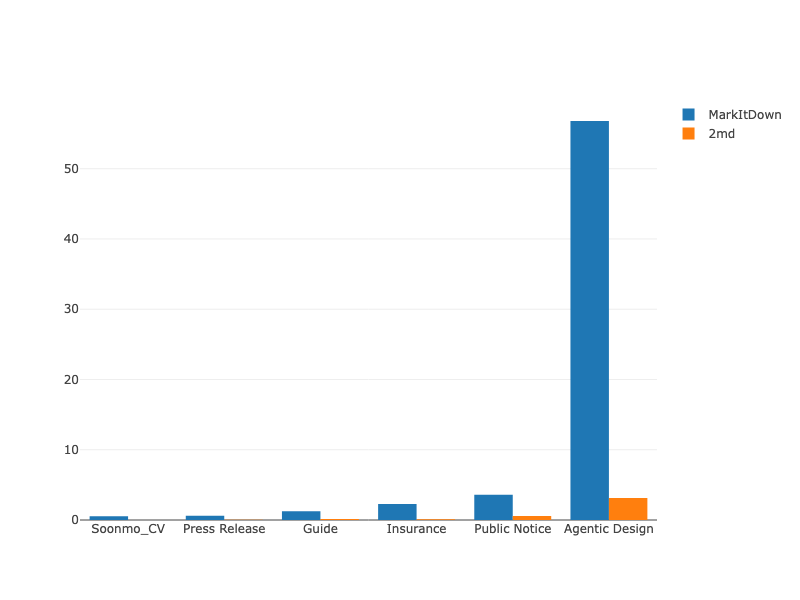

# Comprehensive Benchmark Report: 2md vs MarkItDown

This report combines the runtime benchmark with the full output of [`evaluate.py`](/Users/soonmoseong/Documents/Documents%20-%20Soonmo%E2%80%99s%20MacBook%20Pro/2md/benchmark/analysis/evaluate.py). The performance section measures conversion speed. The evaluation section uses the **original PDF as ground truth**, scores `2md` and `markitdown` **independently against that same PDF**, and then compares the two score sets side by side using [`comprehensive_evaluation.csv`](/Users/soonmoseong/Documents/Documents%20-%20Soonmo%E2%80%99s%20MacBook%20Pro/2md/benchmark/analysis/comprehensive_evaluation.csv).

## 1. Speed Comparison

### Methodology

- **Environment**: macOS (Darwin), zsh
- **Configuration**: `2md` built with `--release`; `markitdown` installed via `uv`
- **Metric**: wall-clock time (`real` seconds) measured with `/usr/bin/time -p`

### Results

| File | MarkItDown (s) | 2md (s) | Speedup Factor |
| :--- | :---: | :---: | :---: |
| `Soonmo_Seong_CV...pdf` | 0.53 | 0.01 | ~53x |
| `[SHARE] Press Release...pdf` | 0.59 | 0.02 | ~30x |
| `The-Complete-Guide...pdf` | 1.26 | 0.13 | ~10x |
| `2025930046 청량리역...pdf` | 3.61 | 0.58 | ~6x |
| `Agentic_Design_Patterns.pdf` | 56.79 | 3.14 | ~18x |
| **Average** | **9.34s** | **0.66s** | **~14x** |

### Visualization

*Figure 1: Conversion time comparison. `2md` keeps a large lead in wall-clock speed.*

Interactive chart: [benchmark_chart.html](benchmark_chart.html)

---

## 2. Full `evaluate.py` Metric Results

### Coverage Note

The current evaluator output in `comprehensive_evaluation.csv` covers **5 matched PDFs**:

- `2025930046 청량리역 롯데캐슬 SKY-L65 불법행위 재공급 입주자모집공고문`
- `The-Complete-Guide-to-Building-Skill-for-Claude`
- `Agentic_Design_Patterns`
- `Soonmo_Seong_CV_20260206`
- `[SHARE] 202601XX_Press Release_Data Superhero_draft (1)`

### Methodology

`evaluate.py` treats extracted PDF text as the ground truth. For each document, it computes:

- `PDF` vs `2md` Markdown
- `PDF` vs `markitdown` Markdown

The comparison in this report is therefore not `2md` vs `markitdown` directly. Instead, both tools are measured against the same original PDF, and then their metric values are compared.

### Metric Interpretation

| Metric | Better Direction | What It Means | Quick Interpretation |
| :--- | :---: | :--- | :--- |
| `MarkdownStructureScore` | Higher | Mean of `HeaderScore`, `ListScore`, `TableScore`, and `ImageScore` | Custom layout-preservation score comparing PDF structure counts against Markdown structure counts |
| `HeaderScore` | Higher | Normalized count similarity between PDF header heuristics and Markdown `#` headers | Measures heading-count preservation |
| `ListScore` | Higher | Normalized count similarity between PDF list heuristics and Markdown list items | Measures list preservation |
| `TableScore` | Higher | Normalized count similarity between PDF table-block heuristics and Markdown table separators | Measures table preservation |
| `ImageScore` | Higher | Normalized count similarity between PDF image count and Markdown image tags | Measures image preservation |
| `Struct` | Higher | Jaccard similarity between PDF-detected headers and Markdown headers | Measures heading preservation only; low values mean PDF heading recovery is weak |
| `Richness` | Context-dependent | Count of Markdown structural elements (`tables`, `lists`, `images`, `headers`) | Output-format metric only; higher means more markup structure was emitted, not automatically better PDF fidelity |
| `Jaccard` | Higher | Unique-token overlap between PDF text and Markdown text | Good for content coverage; ignores order and synonyms |
| `BLEU` | Higher | N-gram precision-oriented overlap between PDF text and Markdown text | Useful for spotting hallucinated or noisy tokens because extra mismatched text gets penalized quickly |
| `Cosine` | Higher | Embedding cosine similarity | Best high-level semantic fidelity signal in this report |
| `L2` | Lower | Euclidean distance between embeddings | Lower means semantically closer |
| `SoftCosine` | Higher | Token similarity using word embeddings | Helps when different words are semantically close |
| `BERTScore` | Higher | Contextual token similarity using BERTScore F1 | More sensitive to semantic phrasing than raw token overlap |
| `EditDist` | Higher | Normalized Levenshtein similarity | Measures literal string closeness after cleaning |

### Average Structure Preservation

| Tool | MarkdownStructureScore | HeaderScore | ListScore | TableScore | ImageScore |
| :--- | ---: | ---: | ---: | ---: | ---: |
| `2md` | 0.312 | 0.062 | 0.313 | 0.245 | 0.628 |
| `markitdown` | 0.310 | 0.051 | 0.590 | 0.000 | 0.600 |

### Structure Score Interpretation

- `2md` has the better overall custom structure score, but only by a tiny margin: `0.312` vs `0.310`.
- `2md` is better on header, table, and image preservation.
- `markitdown` is much better on list-count preservation.
- The raw comparison counts are exported in the CSV as `PDF_Headers`, `PDF_Lists`, `PDF_Tables`, `PDF_Images`, plus per-tool Markdown counts such as `2md_MdTables` and `markitdown_MdTables`.

### Average Across Evaluated Files

| Tool | Struct | Richness | Jaccard | BLEU | Cosine | L2 | SoftCosine | BERTScore | EditDist |
| :--- | ---: | ---: | ---: | ---: | ---: | ---: | ---: | ---: | ---: |
| `2md` | 0.012 | 324.200 | 0.933 | 0.914 | 0.969 | 0.174 | 1.000 | 0.438 | 0.818 |
| `markitdown` | 0.012 | 232.400 | 0.950 | 0.931 | 0.920 | 0.259 | 1.000 | 0.318 | 0.745 |

### Average Head-to-Head Against PDF Ground Truth

| Metric | Better Direction | Better Tool | Why |
| :--- | :---: | :---: | :--- |
| `MarkdownStructureScore` | Higher | `2md` | Slightly better average PDF-to-Markdown layout preservation |
| `HeaderScore` | Higher | `2md` | Better heading-count preservation |
| `ListScore` | Higher | `markitdown` | Better list-count preservation |
| `TableScore` | Higher | `2md` | Better table-count preservation |
| `ImageScore` | Higher | `2md` | Better image-count preservation |
| `Struct` | Higher | Tie | Both tools are equally low on recovered heading overlap |
| `Richness` | Context-dependent | `2md` | `2md` emits more Markdown structure on average |
| `Jaccard` | Higher | `markitdown` | Slightly better token coverage against the PDF text |
| `BLEU` | Higher | `markitdown` | Slightly better precision-style n-gram overlap against the PDF text |
| `Cosine` | Higher | `2md` | Better average semantic similarity to the PDF |
| `L2` | Lower | `2md` | Smaller embedding distance to the PDF |
| `SoftCosine` | Higher | Tie | Both are saturated at `1.000` here |
| `BERTScore` | Higher | `2md` | Better contextual semantic match to the PDF |
| `EditDist` | Higher | `2md` | Closer literal text reconstruction after cleaning |

### Average Result Interpretation

- `2md` leads on `Richness`, `Cosine`, `L2`, `BERTScore`, and `EditDist`, which suggests stronger semantic preservation and closer reconstructed text on average.
- `2md` also has the slightly better custom `MarkdownStructureScore`, driven mainly by better table and image preservation.
- `markitdown` leads on `Jaccard` and `BLEU`, so it retains slightly more direct lexical overlap with the extracted PDF text.
- `markitdown` leads strongly on `ListScore`, so it tracks PDF list counts better in this benchmark.
- `Struct` is tied and near zero for both tools, which means the current header heuristic is not capturing Markdown heading quality well.
- `SoftCosine` is `1.000` for both tools on every evaluated file, so it is not discriminating between outputs in this benchmark.

### Detailed Results: `2md`

| File | Struct | Richness | Jaccard | BLEU | Cosine | L2 | SoftCosine | BERTScore | EditDist |
| :--- | ---: | ---: | ---: | ---: | ---: | ---: | ---: | ---: | ---: |
| `2025930046 청량리역 롯데캐슬 SKY-L65 불법행위 재공급 입주자모집공고문` | 0.000 | 194 | 0.905 | 0.867 | 0.862 | 0.525 | 1.000 | 0.576 | 0.780 |
| `The-Complete-Guide-to-Building-Skill-for-Claude` | 0.060 | 170 | 0.967 | 0.943 | 0.993 | 0.121 | 1.000 | 0.673 | 0.953 |
| `Agentic_Design_Patterns` | 0.000 | 1238 | 0.908 | 0.899 | 0.992 | 0.126 | 1.000 | 0.346 | 0.798 |
| `Soonmo_Seong_CV_20260206` | 0.000 | 9 | 0.976 | 0.977 | 1.000 | 0.019 | 1.000 | 0.023 | 0.842 |
| `[SHARE] 202601XX_Press Release_Data Superhero_draft (1)` | 0.000 | 10 | 0.910 | 0.884 | 0.997 | 0.081 | 1.000 | 0.570 | 0.717 |

### Detailed Results: `markitdown`

| File | Struct | Richness | Jaccard | BLEU | Cosine | L2 | SoftCosine | BERTScore | EditDist |
| :--- | ---: | ---: | ---: | ---: | ---: | ---: | ---: | ---: | ---: |
| `2025930046 청량리역 롯데캐슬 SKY-L65 불법행위 재공급 입주자모집공고문` | 0.000 | 169 | 0.907 | 0.875 | 0.685 | 0.794 | 1.000 | 0.313 | 0.707 |
| `The-Complete-Guide-to-Building-Skill-for-Claude` | 0.060 | 138 | 0.971 | 0.916 | 0.917 | 0.407 | 1.000 | 0.405 | 0.628 |
| `Agentic_Design_Patterns` | 0.000 | 845 | 0.948 | 0.977 | 1.000 | 0.012 | 1.000 | 0.309 | 0.812 |
| `Soonmo_Seong_CV_20260206` | 0.000 | 7 | 1.000 | 1.000 | 1.000 | 0.000 | 1.000 | -0.008 | 0.853 |
| `[SHARE] 202601XX_Press Release_Data Superhero_draft (1)` | 0.000 | 3 | 0.926 | 0.885 | 0.997 | 0.081 | 1.000 | 0.570 | 0.727 |

### Per-File Interpretation

- **청량리역 공고문**: `2md` is better on `BLEU`, `Cosine`, `L2`, `BERTScore`, and `EditDist`, while `markitdown` is only slightly better on `Jaccard`.
- **The Complete Guide**: `2md` is clearly better on `BLEU`, `Cosine`, `L2`, `BERTScore`, and `EditDist`; `markitdown` is only slightly better on `Jaccard`.
- **Agentic Design Patterns**: `markitdown` wins on `Jaccard`, `BLEU`, `Cosine`, `L2`, and `EditDist`, while `2md` still produces richer Markdown and a slightly better `BERTScore`.
- **Soonmo CV**: both tools are effectively semantically identical by `Cosine` and `SoftCosine`; `markitdown` is a little closer lexically, while `2md` emits slightly richer structure.
- **Press Release**: the outputs are nearly tied semantically; `markitdown` is marginally better on lexical and edit-distance metrics, while `2md` emits more Markdown structure.

---

## 3. Overall Takeaway

The performance story is still decisive: `2md` is much faster. On the current `evaluate.py` output, the quality story is more mixed than the previous report implied. `2md` has the stronger average semantic profile by `Cosine`, `L2`, `BERTScore`, and `EditDist`, while `markitdown` has the stronger average lexical overlap by `Jaccard` and `BLEU`.

That means the most accurate summary is: **`2md` is the speed winner and the better semantic average on these 5 evaluated files, while `markitdown` remains competitive or better on direct token-level overlap for some documents.**
